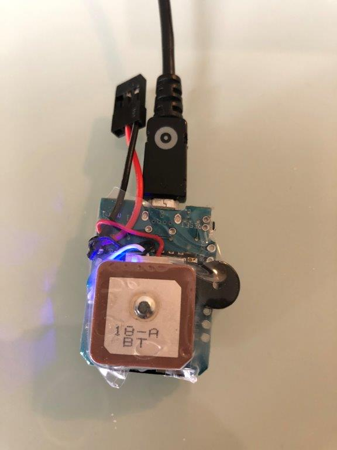

# GPS_Tracker_ESP8266V1  

Balise basé sur https://github.com/f5soh/balise_esp32 et adapté pour un ESP8266 D1 mini.

Fonctionne avec un buzzer actif optionnel et un GPS BN-180 ou un BN-220, pèse 11g.

### Librairie TinyGPS++

Télécharger la librairie zip https://github.com/mikalhart/TinyGPSPlus/releases

 

### Carte 
Se compile avec le type de carte "Generic ESP8266 Module"

Que l'on obtient après avoir ajouté l'URL https://arduino.esp8266.com/stable/package_esp8266com_index.json dans Fichier->Préférences->URL de gestionnaire de cartes supplémentaires et installé "esp8266" dans Outils->Gestionnaire de carte

 

### Câblage

### Face avant 

#### Code du buzzer optionnel

* tick = phase de recherche de satellites
* Beep = un satellite de +
* Beep Beep Beep = enregistrement des coordonnées de départ

#### Code de la led bleue esp8266

*  reste allumée durant la phase de recherche de satellites qui s'achève avec l'enregistrement de la position de départ quand hdop < 2.0 et nb sats > 5
*  change d'état à chaque envoi de trame toutes les 3 secondes

#### Code des leds du GPS

* TX LED BLEUE  : Clignote à chaque donnée transmise
* PPS LED ROUGE : Eteinte lorque le GPS ne reçoit pas de satellite, 1 Pulse Par Seconde si 3D fix => >= 4 satellites
