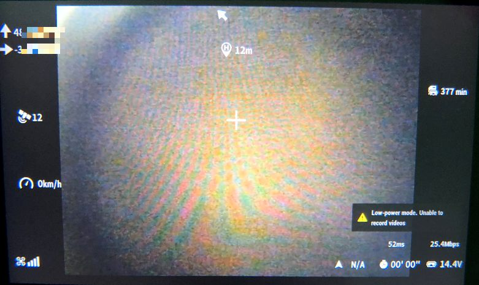
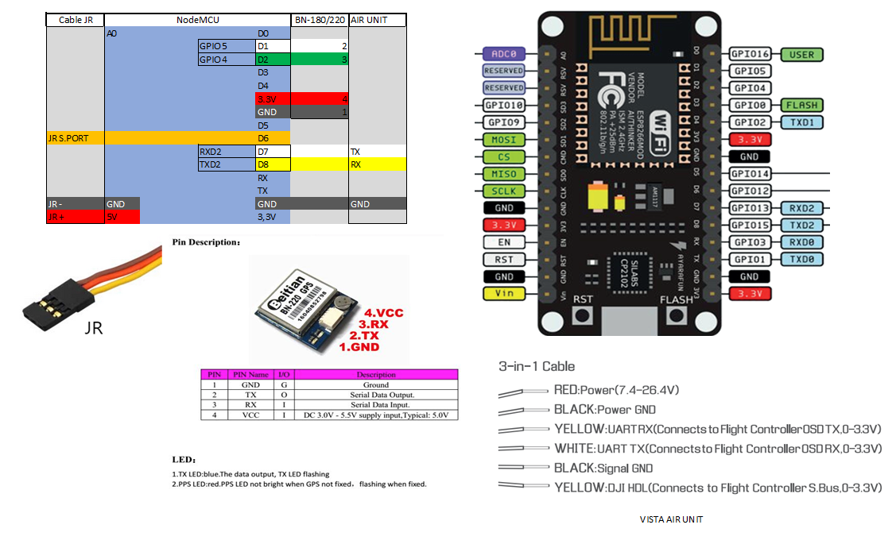

# GPS_Tracker_ESP8266V1_FRSKY_OSD-DJI-AIR-UNIT

Battit au-dessus de GPS_Tracker_ESP8266V1_FRSKY, cette version ajoute une sortie MSP vers une caméra 
DJI FPV Air Unit ou Caddx Vista, ce qui permet d'afficher dans l'OSD les infos provenant du GPS de la balise :
* La latitude, la longitude
* Le nombre de satellites (clignote tant que la position de départ n'est pas définie)
* La vitesse sol
* La direction du point de départ
* La distance au point de départ

La partie FRSKY, également connectée, envoie les données de télémesure à la radio.

### Carte
Ce projet nécessitant 2 UARTs utilise un NodeMCU de la famille ESP8266.
J'ai utilisé la carte NodeMCU Amica V2 ESP8266MOD 12-F de [AZ-Delivery](https://www.az-delivery.de/fr/products/nodemcu) qui se compile avec la carte ESP8266 NodeMCU 1.0 (ESP-12E Module) mais on peut aussi utiliser le D1 Mini qui est un mini nodemcu (https://www.az-delivery.de/fr/products/d1-mini?) qui se compile avec la carte "Generic ESP8266 module", en lui adjoignant éventuellement un régulateur 5V car il est plus délicat que les nodemcu qui embarquent le régulateur AMS1117 .

### Câblage

### Configuration des positions

Editer l'onglet **OSD_positions_config.h**

* Dans le configurateur Betaflight, placez les éléments OSD aux positions souhaitées et, dans le CLI, tapez "set osd" pour récupérer les chiffres.
* La position **234** est non visible. 
* On peut aussi choisir directement la position en utilisant le tableau de  30 caractères X 16 lignes ( Horizontalement 2048-2077(espacement 1), 
verticalement 2048-2528(espacement 32)). La position **2254** correspond à l'emplacement par défaut de la croix.

