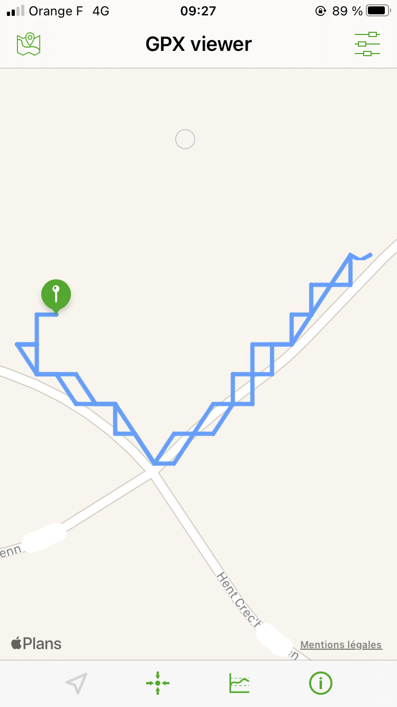
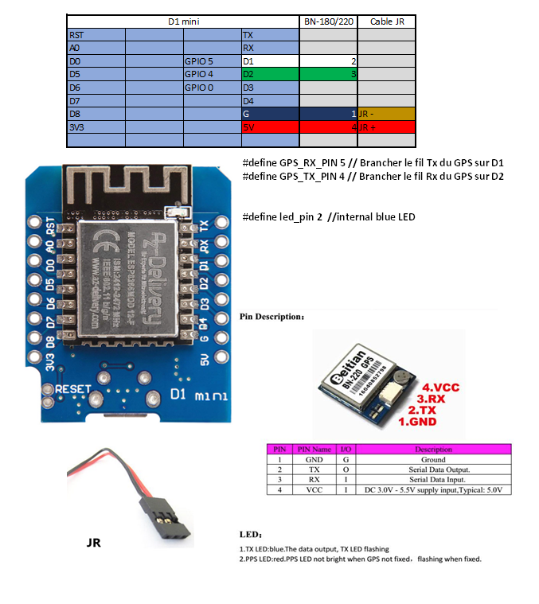

Cette version de balise affiche une carte utilisant Open Street Map, un projet ayant le but de créer une carte libre du monde et Leaflet, une bibliothèque Javascript open-source. 

Elle tourne sur un esp8266 WEMOS D1 mini relié à un GPS BN220 -> carte Wemos D1 R1 et Flash size "4M (FS:none OTA:~1019KB)"

Il suffit de se connecter sur un smartphone, sans mot de passe, sur le réseau qui apparait = concatenation de "BALISE_" et de la MAC adresse, puis avec un navigateur à l'adresse 192.168.1.10.

La partie information affichée en haut provient de la balise, la carte Open Street Map provient de la connexion internet du téléphone via la 4G.
Ce fonctionnement en double accès est obtenu pas défaut sur un iPhone 8, iOS 14, par contre il nécessite l'installation de Speedify sur un Android 8 https://androidphone.fr/peut-on-mettre-les-donnees-mobiles-et-le-wifi-en-meme-temps-sur-android/

 
La case -SAT correspond à l'un des statuts du GPS, on peut avoir WAIT SAT durant la phase de recherche de satelilites, -ou+SAT selon que l'on perd ou gagne 1 satellite, NO SAT en cas de perte totale. 
La carte se déplace sur le point de départ qui est en bas à gauche quand on a suffisamment de satellites, SAT >5 et un HDOP <2. 
Le label HDOP devient ++HDOP si HDOP > 2 et le label SAT devient --SAT si SAT < 5.
À ce moment on affiche la position du départ DLNG et DLAT et le statut ATTENTE passe en DEPART, là on peut décoller, et la balise émet sa trame Beacon sur le canal 6. 
S'affiche également l'heure universelle, le nombre de trames émises, le temps écoulé et la vitesse max.
Par manque de place je n'affiche pas la vitesse instantanée (de toute façon durant le pilotage on ne regarde pas l'écran) ni la direction.
En cas de perte de l'appareil on disposera des dernières infos reçues.

Le bouton **Générer GPX** produit un fichier GPX des couples (Lon, Lat) accumulés

que l'on peut visualiser ici sous IOS avec GPX viewer

L'appui du bouton **Générer GPX** fonctionne correctement sous Android avec Chrome et sous IOS avec Safari

#### Connexion sur la balise
Le nom de réseau doit apparaitre après la mise sous tension de la balise, il est unique et de la forme BALISE_XX_YY... (BALISE+MAC).
Après connexion sans mot de passe, entrez l'adresse 192.168.1.10 dans Chrome ou Safari selon votre modèle de smartphone.

## Câblage

 

