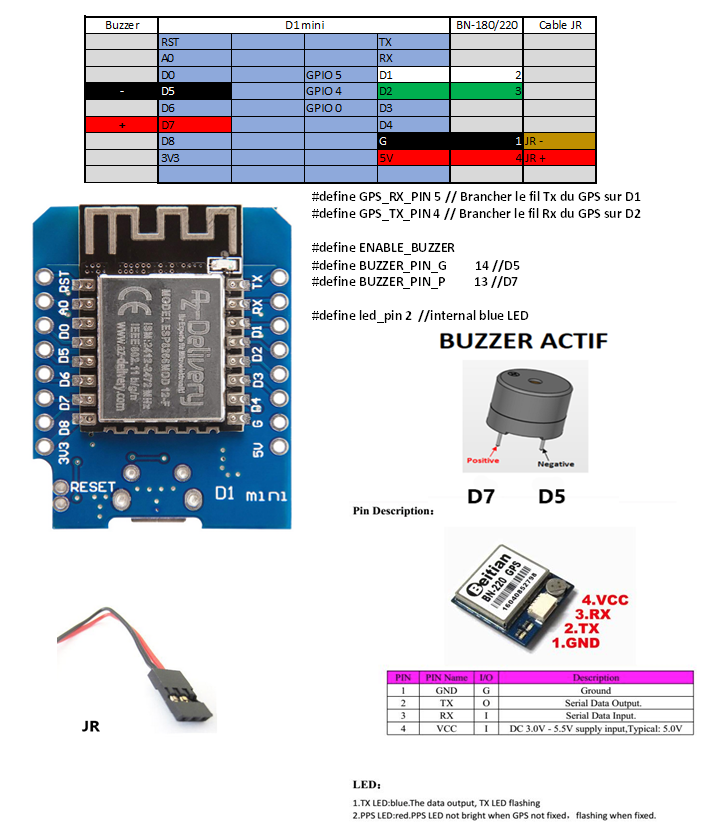

# GPS_Tracker_ESP8266V1_WEB

Cette version tourne sur un esp8266 D1 mini relié à un GPS BN220/180 -> carte Wemos D1 R1 et Flash size "4M (FS:none OTA:~1019KB)"
Il suffit de se connecter sur un smartphone, sans mot de passe, sur le réseau qui apparait = concatenation du SSID et de la MAC adresse, puis avec un navigateur à l'adresse 192.168.1.10. 

### Schéma de câblage

### Code de la LED bleue

* reste allumée durant la phase de recherche de satellites qui s'achève avec l'enregistrement de la position de départ quand hdop < 2.0 et nb sats  > 5
* change d'état à chaque envoi de trame toutes les 3 secondes
