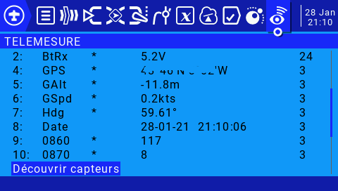
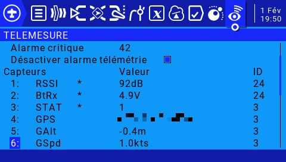
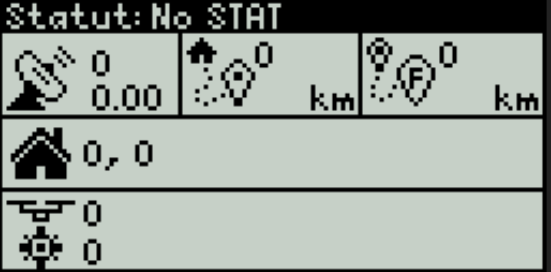

Cette version s'appuie sur la librairie de PawelSky https://www.rcgroups.com/forums/showatt.php?attachmentid=14504485&d=1610286712 à installer dans libraries: 
- Charger le fichier FrSkySportTelemetry_20210110.zip : Croquis-> Inclure une bibliothèque -> Ajouter la bibliothèque .ZIP
- Vérifier que libraries contient le répertoire FrSkySportTelemetry 
- Allez dans Fichier-> Préférences -> Emplacement du carnet de croquis: c'est au bout de ce chemin que se trouve le répertoire libraries

La base est la même que le projet https://github.com/dev-fred/GPS_Tracker_ESP8266/tree/main/GPS_Tracker_ESP8266V1_WEB pour la compilation et la partie smartphone.

Sur la Radio après la découverte des capteurs

Il suffira de renommer 
- 0860 en HDOP et de mettre une Précision de 0.00 
- 0870 en SAT
- 0880 en STAT
- 0890 en VMAX et de mettre une Précision de 0.00 (est en km/h et on peut l'afficher avec le widget Value ou depuis la page WEB de la balise)

En ajoutant le Widget Balise contenu dans le fichier WIDGETS.zip on pourra afficher facilement les coordonnées GPS, le HDOP, le nombre de SAT et le STATUS

### Note
Ce Widget utilise 1/4 d'écran et permet de conserver les sliders.

# Adaptation du projet moschotto
https://github.com/moschotto/OpenTX_GPS_Telemetry  

En plus du statut de la balise, il affiche la distance par rapport au point de Départ, la distance du trajet parcourue et il enregistre le parcourt dans le fichier LOGS/GPSpositions.txt

### Note
La phase découverte et le renommage des capteurs sont identiques

## Radios with 480x272 pixel displays (X10/T16/TX16/T18)

- Copier le contenu de X10.zip sur la carte SD
- Choisir le Widget GPS, il occupe 1/2 écran
- GPSviewerT16 s'execute depuis la page OUTILS

## Radios with 212x64 pixel displays (X9D/X9D+/X9E)

- Copier le contenu de X9.zip sur la carte SD
- Configurer la page AFFICHAGE/Ecran x Script GPSx9 
- GPSviewerX9 s'execute depuis la page OUTILS

## Radios with 128x64 pixel displays (X7/X9 Lite/X-Lite)

- Copier le contenu de X7.zip sur la carte SD
- Dans la page AFFICHAGE/Ecran x Script GPSx9L 
- GPSviewerX9L s'execute depuis la page OUTILS

## Note
Cette version ne peut pas utiliser la fonction delay() dans la boucle principal car celà désamorce le flot de données du Sport; le code du buzzer n'est pas implémenté car il utilise cette fonction.

## Câblage

