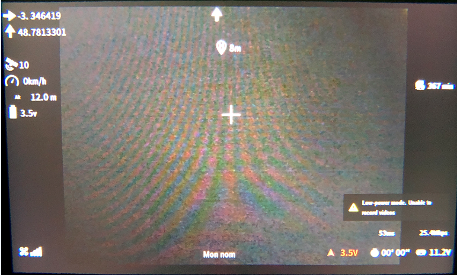
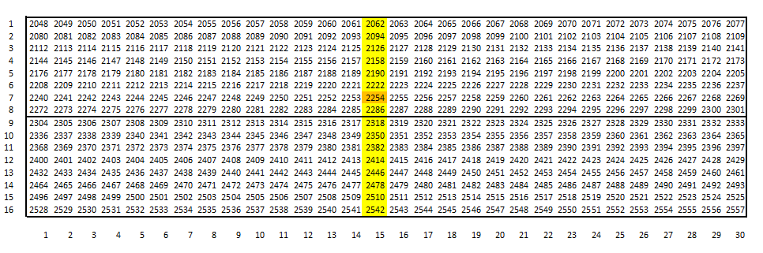

# GPS_Tracker_ESP8266V1_WEB_FRSKY_OSD-DJI-AIR-UNIT

Battit au-dessus de GPS_Tracker_ESP8266V1_WEB_FRSKY, cette version ajoute une sortie MSP vers un 
DJI FPV Air Unit ou Caddx Vista, ce qui permet d'afficher dans l'OSD les infos provenant du GPS de la balise :
* La latitude, la longitude
* Le nombre de satellites (clignote tant que la position de départ n'est pas définie)
* La vitesse sol
* La direction du point de départ
* La distance au point de départ

Cette version permet le déclenchant l'enregistrement quand la position de décollage est connu.
L'UART2 est remplacé par TX1 de l'UART1 qui suffit au pilotage de l'OSD via le MSP ce qui permet d'utiliser un ESP8266 D1 mini ou équivalent.
La partie FRSKY, également connectée, envoie les données de télémesure à la radio.

### Carte
Ce projet utilise un ESP8266 D1 mini ou un NodeMCU.
 
### Câblage

### Configuration des positions

Editer l'onglet **OSD_positions_config.h**

* Dans le configurateur Betaflight, placez les éléments OSD aux positions souhaitées et, dans le CLI, tapez "set osd" pour récupérer les chiffres.
* La position **234** est non visible. 
* On peut aussi choisir directement la position en utilisant le tableau de  30 caractères X 16 lignes ( Horizontalement 2048-2077(espacement 1), 
verticalement 2048-2528(espacement 32)). La position **2254** correspond à l'emplacement par défaut de la croix.

