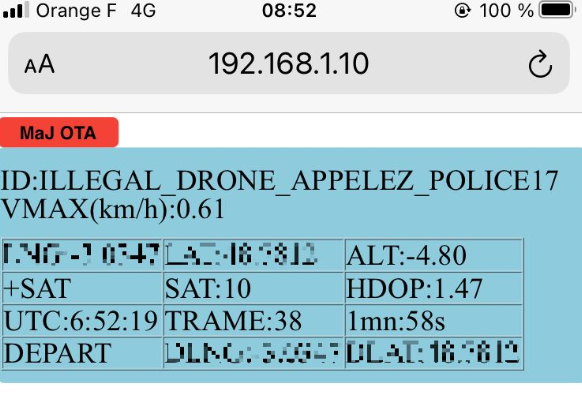
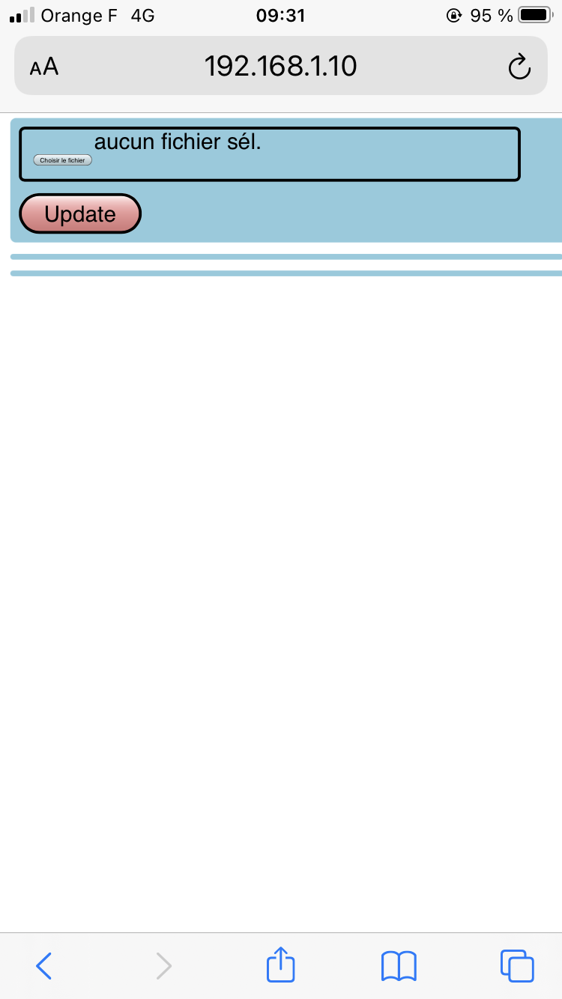
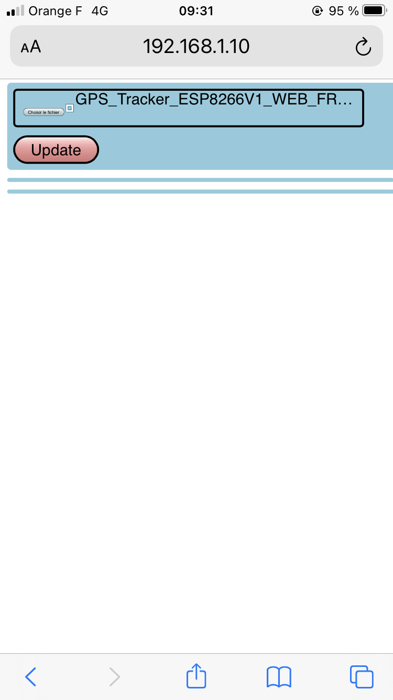
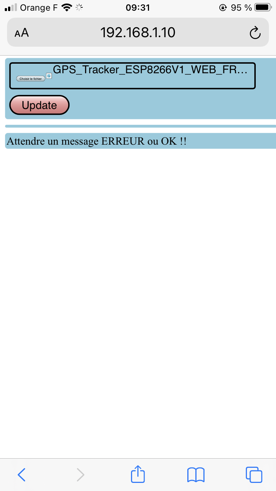
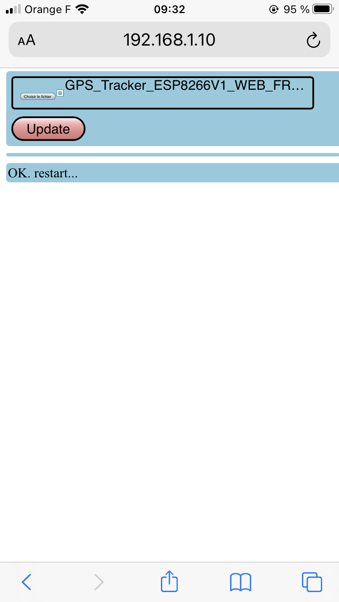
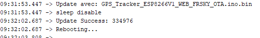

Cette version ajoute l'OTA, la mise à jour sans fil donc, surtout très utile pour un ESP01, à la version GPS_Tracker_ESP8266V1_WEB_FRSKY.
Merci à fanfanlatulipe26 pour sa contribution : https://github.com/fanfanlatulipe26/BaliseDGAC_GPS_Logger

Le premier chargement se fait de façon classique, et par la suite on peut utiliser le système OTA.
Le fichier résultat de compilation qui doit être téléchargé se trouve dans
C:\Users\xxxxx\AppData\Local\Temp\arduino_build_xy zxyz\GPS_Tracker_ESP8266V1_WEB_FRSKY_OTA.ino.bin, identifié facilement par sa date/heure de compilation.

#### Page OTA

#### Choix du fichier ino, chargé au préalable sur le smartphone

#### Lancement du chargement

#### Fin du chargement

#### Message envoyé à la console

### Note

Dans la cas d'un ESP01, modifier le fichier ino de la façon suivante: 
#### Pour le GPS :
1. #define GPS_RX_PIN 0            // (PIN 5)D1 Brancher le fil Tx du GPS : ESP01 PIN 0 GPIO0 Brancher le fil Tx du GPS
2. #define GPS_TX_PIN 2            // (PIN 4)D2 Brancher le fil Rx du GPS : ESP01 PIN 2 GPIO2 Brancher le fil Rx du GPS 
#### Pour la télémétrie :
3. #define SPORT_PIN FrSkySportSingleWireSerial::SOFT_SERIAL_PIN_3                //frsky sport  D8 : ESP01 PIN 3 GPIO3 Brancher le fil Sport du récepteur Frsky

