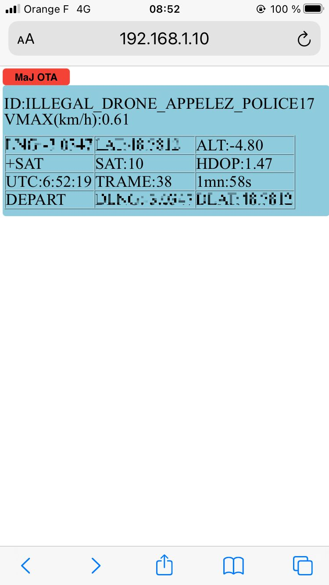

Cette version ajoute l'OTA, la mise à jour sans fil donc, à la version GPS_Tracker_ESP8266V1_WEB_FRSKY.
Merci à fanfanlatulipe26 pour sa contribution : https://github.com/fanfanlatulipe26/BaliseDGAC_GPS_Logger

Le premier chargement se fait de façon classique, et par la suite on peut utiliser le système OTA.
Le fichier résultat de compilation qui doit être téléchargé se trouve dans
C:\Users\xxxxx\AppData\Local\Temp\arduino_build_xy zxyz\GPS_Tracker_ESP8266V1_WEB_FRSKY_OTA.ino.bin
On l'identifie facilement par la date/heure de compilation.

 

