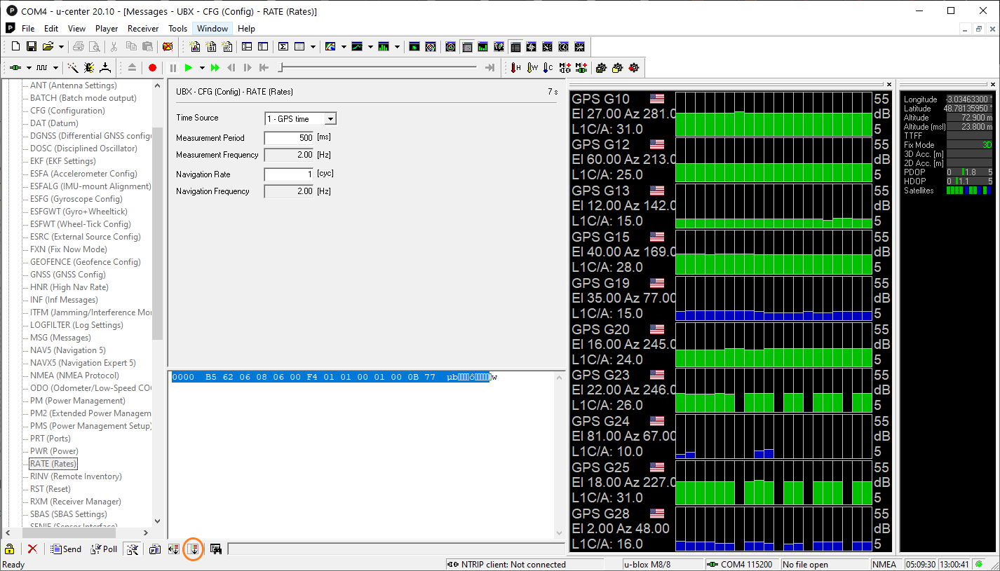
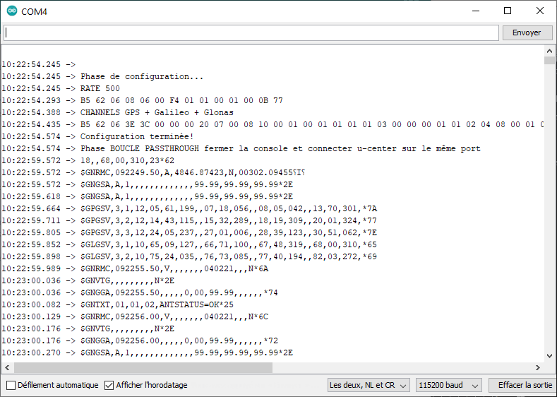

Provient de https://github.com/loginov-rocks/UbxGps/blob/master/extras/Configuration/Auto-configuration-Mega/Auto-configuration-Mega.ino

  
Pour trouver la séquence d'octets liée à une fonction, on utilise les écrans se trouvant sous "Message View" -> UBX -> CFG 
En cliquant le bouton Show Hex Toggle ( avant dernier en bas à gauche ), on ouvre une fenêtre contenant les octets correspondant à une configuration
ce bouton reste grisé si l'on accède aux écrans depuis "Config View".



Exemple de séquence:
RATES 500: B5 62 06 08 06 00 F4 01 01 00 01 00 0B 77 

permet de construire 
```
void Rate500()
{     
  byte packet[] = {0xB5, 0x62, 0x06, 0x08, 0x06, 0x00, 0xF4, 0x01, 0x01, 0x00, 0x01, 0x00, 0x0B, 0x77};
    sendPacket(packet, sizeof(packet));
}
```

RATES 100: B5 62 06 08 06 00 64 00 01 00 01 00 7A 12 
 
32 UBX Protocol p168 ->  https://www.u-blox.com/sites/default/files/products/documents/u-blox8-M8_ReceiverDescrProtSpec_%28UBX-13003221%29.pdf
 
### Notes : 
La mise à jour d'un écran de paramètres affichés par u-center se fait grâce à la touche "Poll" the message: 
le titre du message choisi, dans la colonne de gauche, change brièvement de couleur quand il est mis à jour. 

La configuration n'est pas sauvegardée dans la flash, le but est de mettre au point une séquence de configuration



