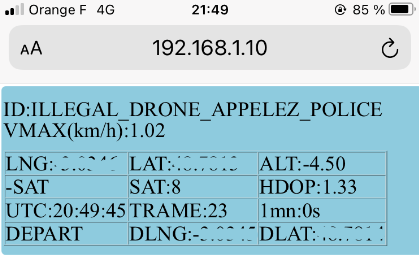
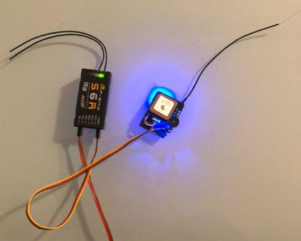

#### Préambule

Durant la mise au point des balises, voici un décodeur/afficheur de trames beacons bien pratique basé sur une carte TTGO T-Display ESP32 décrite ici http://www.lilygo.cn/prod_view.aspx?TypeId=50033&Id=1126&FId=t3:50033:3

https://github.com/dev-fred/Decode_balise_ESP32/tree/master/Decode_Balise_ESP32_TFT

# GPS_Tracker_ESP8266V1  

### [Code](GPS_Tracker_ESP8266V1)

 

Balise basé sur https://github.com/f5soh/balise_esp32 et adapté pour un ESP8266 D1 mini.

Fonctionne avec un buzzer actif optionnel et un GPS BN-180 ou un BN-220, pèse 11g.

# GPS_Tracker_ESP8266V1_FRSKY

### [Code](GPS_Tracker_ESP8266V1_FRSKY)

Battit au-dessus de GPS_Tracker_ESP8266V1, cette version ajoute une sortie FRSKY S.port sur le connecteur JR d'alimentation afin d'envoyer les données du GPS de la balise à un récepteur FRSKY via la télémétrie que l'on pourra afficher avec un script LUA.
Le gros avantage c’est la réception des infos GPS à travers la télémétrie qui passe par le couple émetteur/récepteur qui a une bien meilleure portée que le couple Balise/Smartphone ce qui permet à la balise de rendre un service de localisation assez fiable en cas de perte de l’appareil.

# GPS_Tracker_ESP8266V1_WEB

### [Code](GPS_Tracker_ESP8266V1_WEB)

Ajoute un serveur WEB dans la balise qui permet de recevoir en même temps que la trame est émise, les données GPS sur son smartphone via un navigateur. Il faudra au préalabre se connecter sur l'adresse IP de ce serveur.

# GPS_Tracker_ESP8266V1_WEB_FRSKY

### [Code](GPS_Tracker_ESP8266V1_WEB_FRSKY)

Battit au-dessus de GPS_Tracker_ESP8266V1_WEB, cette version ajoute une sortie FRSKY S.port sur le connecteur JR d'alimentation afin d'envoyer les données du GPS de la balise à un récepteur FRSKY via la télémétrie que l'on pourra afficher avec un script LUA.
Le gros avantage c’est la réception des infos GPS à travers la télémétrie qui passe par le couple émetteur/récepteur qui a une bien meilleure portée que le couple Balise/Smartphone ce qui permet à la balise de rendre un service de localisation assez fiable en cas de perte de l’appareil.

# GPS_Tracker_ESP8266V1_WEB_FRSKY_OSD-DJI-AIR-UNIT

### [Code](GPS_Tracker_ESP8266V1_WEB_FRSKY_OSD-DJI-AIR-UNIT)

Battit au-dessus de GPS_Tracker_ESP8266V1_WEB_FRSKY, cette version ajoute une sortie MSP vers une caméra 
DJI FPV Air Unit ou Caddx Vista, ce qui permet d'afficher dans l'OSD les infos provenant du GPS de la balise :
* La latitude, la longitude
* Le nombre de satellites (clignote tant que la position de départ n'est pas définie)
* La vitesse sol
* La direction du point de départ
* La distance au point de départ
La partie FRSKY, également connectée, envoie les données de télémesure à la radio.
Ce projet nécessitant 2 UARTs utilise un NodeMCU de la famille ESP8266.

# GPS_Tracker_ESP8266V1_MAP

Projet retiré, il ne tient pas ses promesses; la portée de la balise et la fréquence d'échantillonage des positions GPS sont trés insuffisantes.
